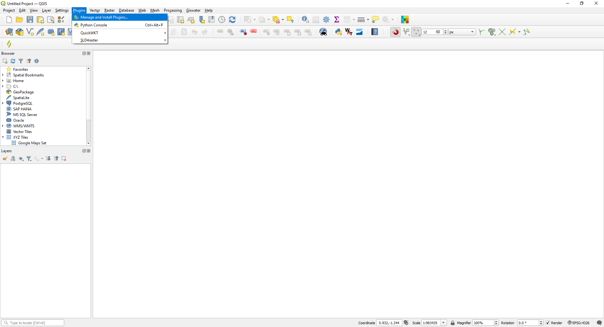
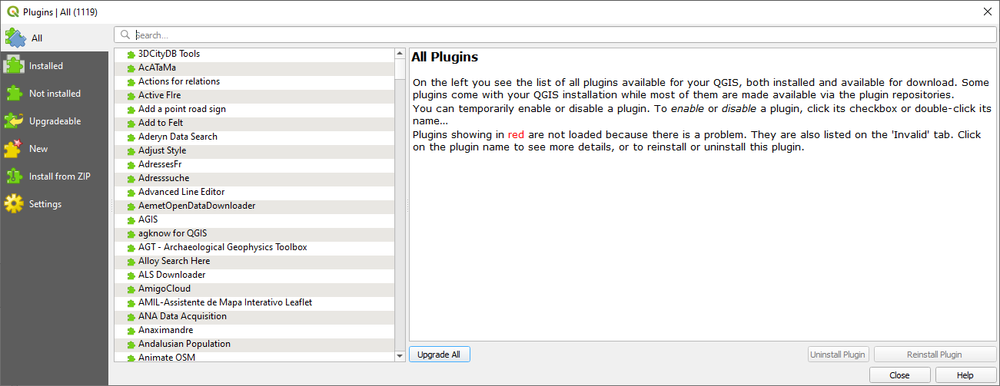
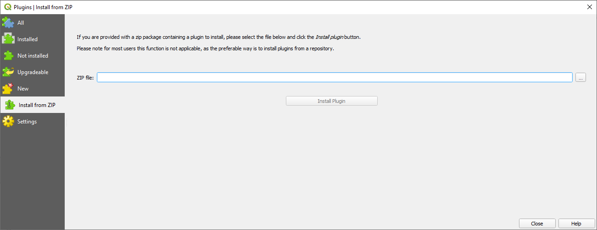
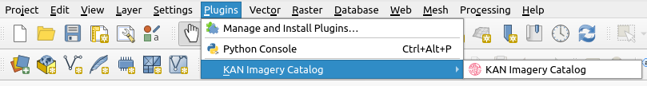

# Plugin Installation
1. Download the compressed plugin from <a href="https://github.com/Kan-T-IT/QGIS-KICa/releases" target="_blank">this link</a>

2. Once downloaded, open QGIS (it is recommended to use the latest stable version).
3. In the toolbar, go to **Plugins** and select "Manage and Install Plugins."

       

       A window like the following will open:

       

4. To install the plugin, you need to go to "Install from ZIP" and select the location of the previously downloaded ZIP file from your local disk.

       

5. Once loaded, click on "Install Plugin" and wait for it to finish installing. Once installed, docs/index.mdyou will see the "Kan Imagery Catalog" icon in the "Plugins" toolbar.

       
