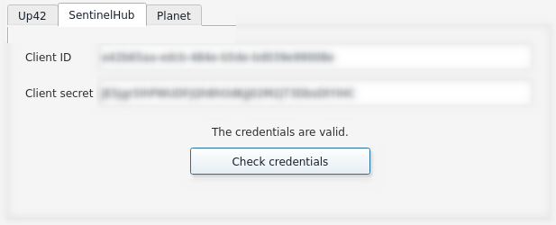
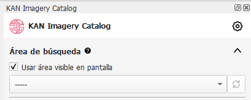
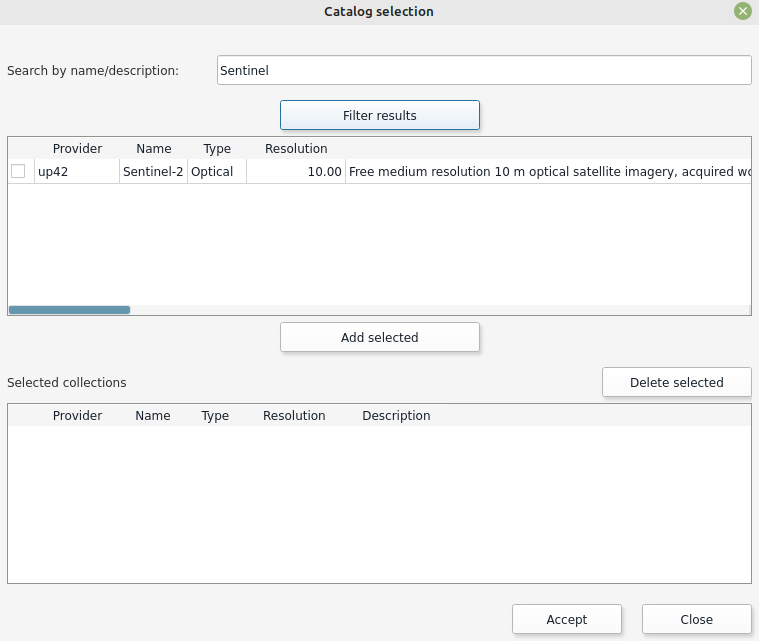
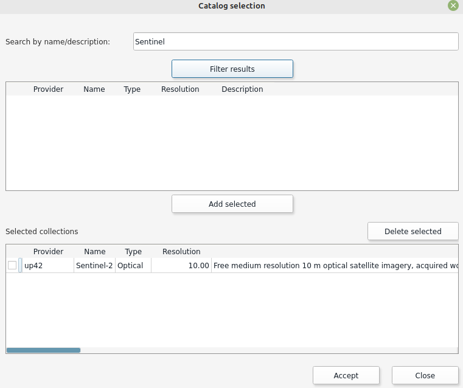
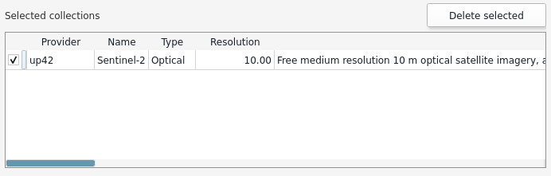
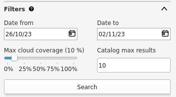
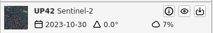
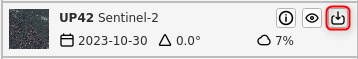

# Plugin
When you open the Kan Imagery Catalog plugin, it will appear on the right side of the QGIS screen with the following sections:

   

- **Configuration**
- **Search Area**
- **Catalog Selection**
- **Filters**
- **Listing**

## Configuration
To use the Kan Imagery Catalog plugin, the first thing to do is to configure the credentials that will be used to connect to different image providers.

### Credentials UP42
At this point, we will proceed with configuring the credentials for UP42. To proceed, you need a username and password on the provider's platform. To sign up, you can visit <a href="https://console.up42.com/log-in" target="_blank">https://console.up42.com/log-in</a>.

Once you have enabled your user and loaded the first project, you can access the information required by the plugin to use it.

   

The plugin requests the following information to connect to the provider:

  - **Username**
  - **Password**

!!! note

    You can find this information on the UP42 portal > Projects > Developers.

After loading the necessary data, you can verify the credentials.

   

If they are valid, you will see the message **"Credentials are valid."**

### Credentials Sentinel Hub

At this point, we will proceed with configuring the credentials for Sentinel Hub. To proceed, you need a username and password on the provider's platform. To sign up, you can visit sentinel-hub <a href="https://apps.sentinel-hub.com/dashboard/#/account/settings" target="_blank">account settings</a>.

Once you have enabled your user, you need to register an OAuth Client in your account settings to access the information required by the plugin to use it.

   

The plugin requests the following information to connect to the provider:

  - **Client ID**
  - **Client secret**

!!! tip

    Follow sentinel-hub <a href="https://docs.sentinel-hub.com/api/latest/api/overview/authentication/#registering-oauth-client" target="_blank">documentation</a>.

After loading the necessary data, you can verify the credentials.

   

If they are valid, you will see the message **"Credentials are valid."**

### Credentials Microsoft

Microsoft Planetary Computer Data Catalog is freely accessible therefore is already incorporated in the plugin and credentials are not necessary.

### Credentials Planet

Coming next

### General Parameters

In addition to loading credentials, the user can set the following parameters:

  - **Number of Query Days**
  - **Default Maximum Cloud Cover:** Can vary between 0 and 100%.
  - **Maximum Number of Catalogs**
  - **Maximum Number of Objects per Catalog**

  

Once the general parameters are set, apply the changes by clicking **OK**.

## Search Area

With the search area, the user can define the bounding box where the plugin will search for image availability.

You can use the extent of what is currently visible in QGIS by selecting "Use visible area on screen," or choose a polygon geometry layer being used in the current QGIS project.

If the "Use visible area on screen" option is selected, the plugin will recognize the visible area in the canvas as the search area.

  

To use the area of a vector layer, it must be loaded in the project. The user should deselect "Use visible area on screen," which will display a list of available layers.

  

!!! tip

    When using a vector layer as the search area, EPSG 4326 is recommended.

!!! note

    In the case of multipolygon vector layers, if a spatial object is selected, the plugin will recognize it as the search area. Otherwise, the plugin will randomly select a spatial object from the layer to define the search area.

## Catalog Selection

In this section, the user can select the catalogs and collections they want to query.

  

In the search by name or description field, the user can filter by the value they enter. If left blank and filtered, all catalogs from the provider(s) being queried will be listed.
For example, if you enter "Sentinel" in the search field and filter:

  

By selecting the catalog in the first window and clicking "Add Selected," the collections will move to the second window. To proceed with these preferences, click "OK."

    

### Remove Catalogs and Collections

If the user wants to exclude the collections they had previously set, they should reopen the Catalog Selection window, select the "Selected Collections," and remove them before clicking OK to save the changes.

  

## Filters
Before searching for collections, you can set various supplementary search criteria:

  - Start Date
  - End Date
  - Cloud Cover
  - Record Limit

  

### Start Date and End Date
In this case, you can specify the range of dates the plugin will use to search for images.
By default, the plugin searches for images from 7 (seven) days before the query date.

  

### Cloud Cover
You can determine the maximum percentage of cloud cover the filtered collections should have.

### Record Limit
You can set a maximum limit on the number of records for the collections you search for. The plugin is configured with a maximum of 10 records by default, but the user can modify it as desired.

## Search and Listing
Once you have defined the search area, catalogs, collections, and filters, you can proceed with the search.

  

The search results will display a maximum of 10 (ten) records, as set in the Filters.

  

The results can be sorted in ascending or descending order based on the acquisition date.

If you have selected to use a polygon as search area, before beginning the search you should have selected the feature beforehand.

  

## Results Functions
You will find three functions:

  - Information
  - Quick View
  - Download

### Information
The "i" icon refers to the general information of the selected collection.

  

A window with additional information will open.

  

### Quick View
Using the eye icon button, the user can quickly view the selected image. The quick view includes a footprint (image coverage) and a raster preview.

  

  

### Download
Using the download button, it sends you directly to the providers catalog in order to download the selected image.

  
