# User Guide

## Plugin Installation
1. Download the compressed plugin from <a href="https://github.com/Kan-T-IT/QGIS-KICa/releases" target="_blank">this link</a>.

2. Once downloaded, open QGIS (it is recommended to use the latest stable version).
3. In the toolbar, go to **Plugins** and select "Manage and Install Plugins."

   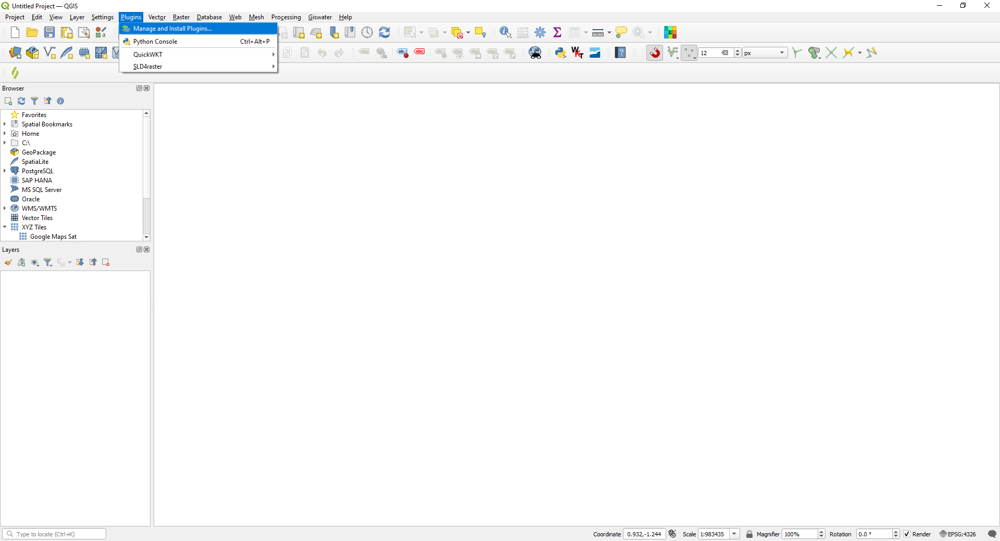

   A window like the following will open:

   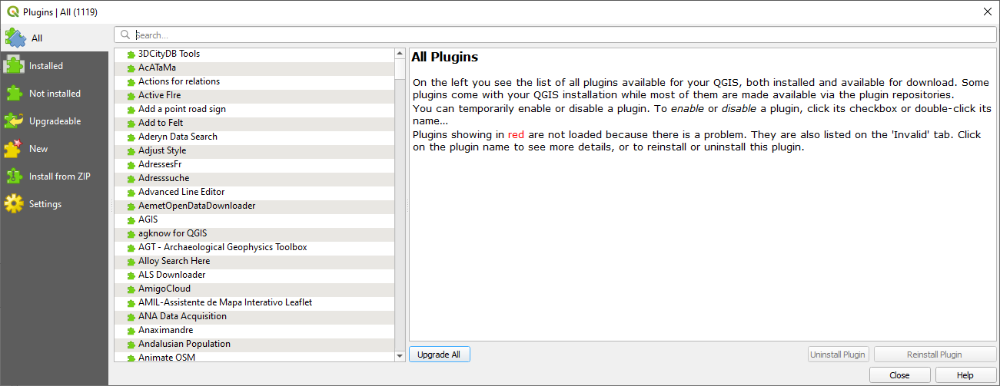

4. To install the plugin, you need to go to "Install from ZIP" and select the location of the previously downloaded ZIP file from your local disk.

   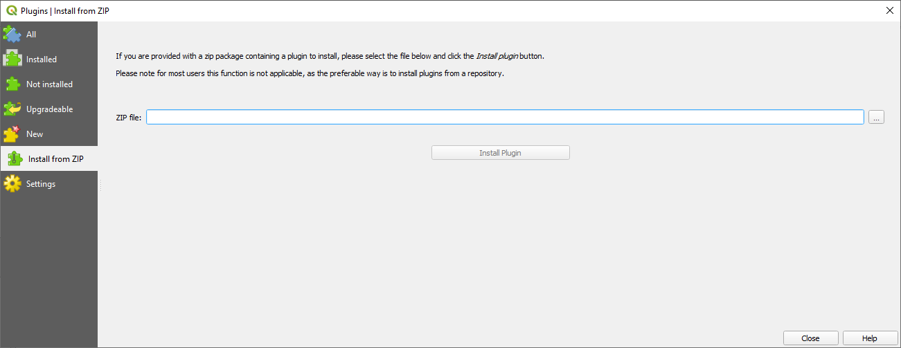

5. Once loaded, click on "Install Plugin" and wait for it to finish installing. Once installed, docs/index.mdyou will see the "Kan Imagery Catalog" icon in the "Plugins" toolbar.

   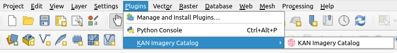

## Plugin
When you open the Kan Imagery Catalog plugin, it will appear on the right side of the QGIS screen with the following sections:

   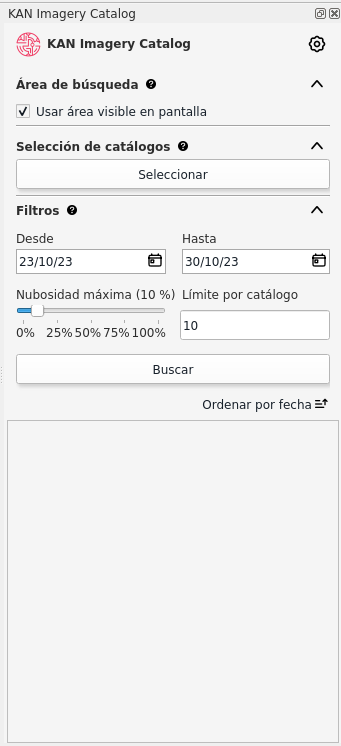

- **Configuration**
- **Search Area**
- **Catalog Selection**
- **Filters**
- **Listing**

### Configuration
To use the Kan Imagery Catalog plugin, the first thing to do is to configure the credentials that will be used to connect to different image providers.

#### Credentials UP42
- At this point, we will proceed with configuring the credentials for UP42. To proceed, you need a username and password on the provider's platform. To sign up, you can visit <a href="https://console.up42.com/log-in" target="_blank">https://console.up42.com/log-in</a>.

- Once you have enabled your user and loaded the first project, you can access the information required by the plugin to use it.

   

- The plugin requests the following information to connect to the provider:
  - **Project ID**
  - **API ID**

  *Hint:* You can find this information on the UP42 portal > Projects > Developers.

   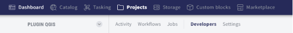

- After loading the necessary data, you can verify the credentials.

   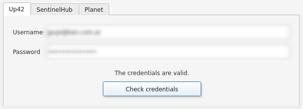

  - If they are valid, you will see the message **"Credentials are valid."**

#### Credentials Sentinel HUB
- Coming next

#### Credentials Planet
- Coming next

#### General Parameters
- In addition to loading credentials, the user can set the following parameters:
  - **Language:** Choose from Spanish, English, or Portuguese.
  - **Number of Query Days**
  - **Default Maximum Cloud Cover:** Can vary between 0 and 100%.
  - **Download Path**
  - **Maximum Number of Catalogs**
  - **Maximum Number of Objects per Catalog**

  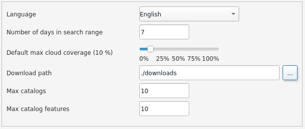

- Once the general parameters are set, apply the changes by clicking **OK**.

### Search Area
- With the search area, the user can define the bounding box over which the plugin will search for image availability.

- You can use the extent of what is currently visible in QGIS, meaning you can use "Use the visible area on the screen" in this case, or you can select a polygon geometry layer used in the current QGIS project.

  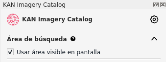

### Catalog Selection
- In this section, the user can select the catalogs and collections they want to query.

  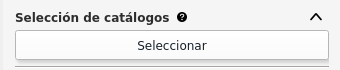

- In the search by name or description field, the user can filter by the value they enter. If left blank and filtered, all catalogs from the provider(s) being queried will be listed.
- For example, if you enter "Sentinel" in the search field and filter:

  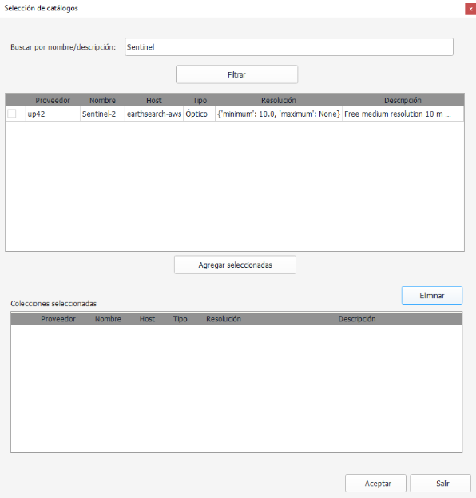

  - By selecting the catalog in the first window and clicking "Add Selected," the collections will move to the second window. To proceed with these preferences, click "OK."
  
    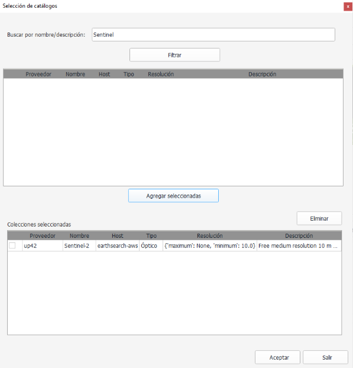

#### Remove Catalogs and Collections
- If the user wants to exclude the collections they had previously set, they should reopen the Catalog Selection window, select the "Selected Collections," and remove them before clicking OK to save the changes.

  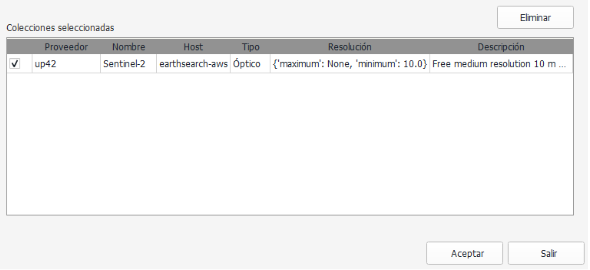

### Filters
- Before searching for collections, you can set various supplementary search criteria:
  - Start Date
  - End Date
  - Cloud Cover
  - Record Limit

  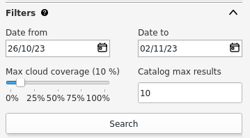

#### Start Date and End Date
- In this case, you can specify the range of dates the plugin will use to search for images.
- By default, the plugin searches for images from 7 (seven) days before the query date.

  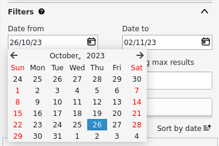

#### Cloud Cover
- You can determine the maximum percentage of cloud cover the filtered collections should have.

#### Record Limit
- You can set a maximum limit on the number of records for the collections you search for. The plugin is configured with a maximum of 10 records by default, but the user can modify it as desired.

### Search and Listing
- Once you have defined the search area, catalogs, collections, and filters, you can proceed with the search.

  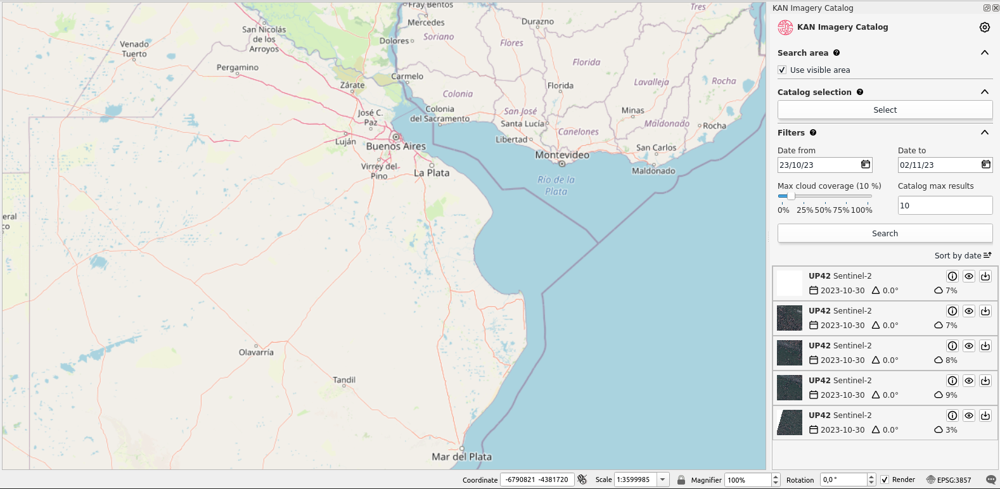

- The search results will display a maximum of 10 (ten) records, as set in the Filters.

  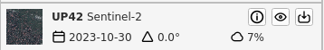

- The results can be sorted in ascending or descending order based on the acquisition date.

### Results Functions
- You will find three functions:
  - Information
  - Quick View
  - Download

#### Information
- The "i" icon refers to the general information of the selected collection.

  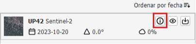

- A window with additional information will open.

  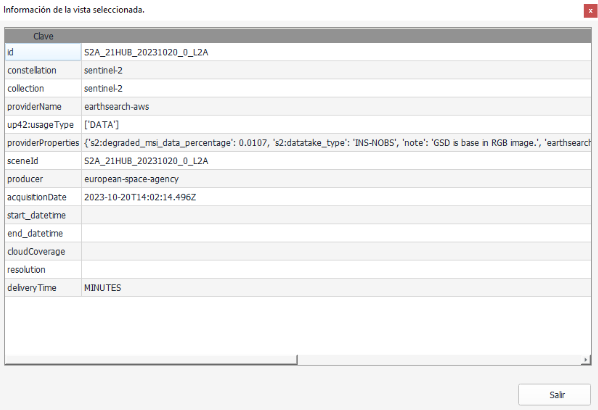

#### Quick View
- Using the eye icon button, the user can quickly view the selected image. The quick view includes a footprint (image coverage) and a raster preview.

  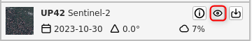

  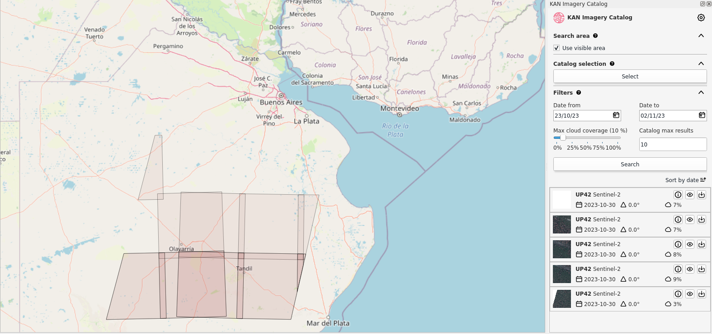

#### Download
- Using the download button, it sends you directly to the providers catalog in order to download the selected image.

  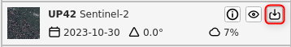
